# 成就
## 简介
截至29.0版本，Bloons TD 6至今共获得138个成就：125个可见成就，12个隐藏成就。

## 普通成就
| 图标 | 名称 | 解锁条件 |
| - | - | - |
| 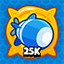 | MOAB刺杀 | 摧毁25,000个MOAB |
|  | BFB克星 | 摧毁10,000个BFB |
| 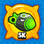 | ZOMG终结者 | 摧毁5,000个ZOMG |
|  | 我狠狠教训了DDT一顿 | 摧毁5,000个DDT |
| 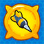 | 首胜 | 在1个非教程新手地图上获胜 |
| 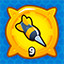 | 蚱蜢 | 在9个不同的新手地图上获胜 |
|  | 下一级 | 在中级地图上赢1回合游戏 |
|  | 侍僧 | 在5个不同的中级地图上获胜 |
|  | 高级玩家 | 在高级地图上赢得1回合游戏 |
| 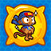 | 大猩猩 | 部署一座4级猴塔 |
|  | 巨型猴子 | 部署一个5级猴子塔 |
|  | 英雄时间 | 在非教程地图上部署英雄 |
| 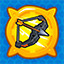 | 英雄气概 | 使用任意4级英雄技能 |
|  | 越大越坏 | 使用任意5级英雄技能 |
|  | 史诗英雄 | 任意英雄等级升级到20 |
|  | 猴复仇者联盟 | 使用4个不同英雄赢得游戏 |
|  | 你有力量 | 第一次使用力量 |
|  | 超级用户 | 使用力量25次 |
|  | 学生 | 应用你的第一个猴子知识点 |
|  | 学者 | 应用10个猴子知识点 |
|  | 知识渊博的灵长类动物 | 解锁在一个分支所有猴子的知识 |
|  | 第一只猴子第一 | 赢得仅使用主要猴子的10次游戏 |
|  | 战争猴子 | 赢得仅使用军事猴的10次游戏 |
| 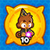 | 魔法猴子 | 赢得仅使用魔法猴的10次游戏 |
|  | 幸存者 | 在天启模式下轮播100 |
|  | 可击破 | 赢得25游戏难以克服的困难 |
|  | 角色反转者 | 以相反模式赢得游戏 |
|  | 奖牌获得者 | 获得地图的所有奖牌 |
|  | 装饰英雄 | 在新手地图获得36枚奖牌 |
|  | 红蓝配...... | 击破100,000个紫色气球 |
|  | 红外线 | 击破250,000个迷彩气球 |
| 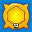 | 合力制胜 | 收集至少12种不同的力量 |
|  | 挑战者 | 赢得1场每日挑战 |
|  | 挑战学徒 | 赢得10场每日挑战 |
|  | 打字机 | 在点击模式下完成1个地图 |
|  | 超级打字机 | 在点击模式下完成5个地图 |
|  | 合作 | 在合作模式下完成1张地图 |
|  | 四重乐趣 | 在4玩家合作模式下完成1张地图 |
|  | 三重威胁 | 在3玩家合作模式下完成1张地图 |
|  | 合作！ | 屏幕时同时有4个英雄 |
|  | 年度新人 | 10分钟内完成一场竞速比赛 |
|  | 明日之星 | 5分钟内完成一场竞速比赛 |
| 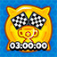 | 游戏巅峰 | 3分钟内完成一场竞速比赛 |
|  | 半岛辉煌战役 | 在半岛击破{0}个气球 |
| 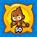 | 基础型 | 同时在一张地图上放置50个猴子塔 |
|  | 彩虹是魔法 | 使用魔法猴子击破{0}个彩虹气球 |
|  | 塔守护者 | 一次拥有200只insta猴子 |
|  | 冒险家 | 完成一个征程 |
| 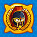 | 经验丰富的冒险家 | 完成一个困难征程 |
|  | 千方百计 | 在所有3种难度下完成一个征程 |
|  | 全速前进！ | 1小时内完成1个征程 |
|  | 珠光宝气 | 购买一个奖杯商店物品 |
|  | 生死边缘 | 在只剩1条命的条件下在CHIMPS/不可击破模式的游戏中获胜 |
|  | 猴子粉丝俱乐部 | 创建或登录您的Ninja Kiwi账户，在云端保存您的进度 |
|  | 注册 | 用机枪猴击破1,000,000个气球 |
|  | 疯狂优惠券 | 在奖杯商店至少消费50个奖杯 |
|  | 限时出售 | 在奖杯商店至少购买1件新限时收藏品 |
|  | 达尔文工具 | 升级塔20,000次 |
|  | 成就中的成就 | 集齐 35 项成就 |
|  | What is this new Bloonery? | Defeat a Tier 1 Boss |
| 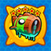 | Who's the Boss? | Defeat a Tier 5 Boss |
| 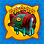 | I'm the Boss | Defeat a Tier 5 Elite Boss |
|  | Apotheosis | Upgrade to a Monkey Paragon Tower |
| 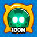 | 不可击破 | 击破100,000,000个气球 |
|  | 工兵 | 击破5,000,000个强化气球或MOAB级气球 |
|  | 增效 | 使用力量100次 |
|  | 猴子博士 | 花费106个猴子知识点 |
|  | 无名猴子 | 赢得仅使用支持猴子的10次 |
| 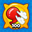 | 充气 | 在放气模式下赢得100回合 |
|  | 独立 | 赢得25场比赛的替补轮次 |
|  | 节俭 | 以一半现金模式赢得10场比赛 |
|  | 气球怪兽！ | 对战双倍生命值MOAB赢得25场比赛 |
|  | 挑战大师 | 赢得100场每日挑战 |
|  | 完美的一周 | 在一周内完成所有每日挑战 |
| 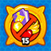 | 终极打字机 | 在点击模式下完成15个地图 |
| 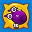 | 超级 BAD | 摧毁1,000个BAD |
|  | 当情况变得艰难时... | 在合作模式困难难度下赢得10场游戏胜利 |
|  | 好心的捐助者 | 在合作模式下给予10000块钱 |
|  | 慷慨的捐助者 | 在合作模式下给予50000块钱 |
|  | 猴子捐助人 | 在合作模式下给予100000块钱 |
|  | 猴子慈善家 | 在合作模式下给予1000000块钱 |
|  | 力量共享 | 在合作模式下使用10种力量 |
|  | 力量势不可挡！ | 在合作模式下使用100种力量 |
|  | Insta防御 | 在合作模式下使用5种Insta |
|  | 协力击破 | 在合作模式下击破10000000个气球 |
| 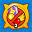 | 2TC | CHIMPS难度，在只有2座猴子塔情况下完成一局游戏 |
|  | 弹指一挥间 | 使用一半初始生命和一半初始现金完成一局游戏 |
|  | 慈善家比尔 | 一口气向一位合作的盟友发送$500,000 |
|  | 500场竞速俱乐部 | 参加500场竞速比赛 |
|  | 最大的挑战 | 创建或完成200次挑战 |
|  | 好看极了 | 使用任意英雄的皮肤赢得100局游戏 |
|  | 气球大师也疯狂 | 使用气球大师炼金术士造成10亿点伤害 |
|  | 我看见你了 | 使用微光显形{0}个气球 |
| 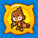 | 一夫当关万夫莫开 | 困难难度下，任何时候屏幕上仅存在1座猴子塔，并赢得一局胜利 |
|  | 生命大师 | 在一局游戏中同时拥有1000条生命 |
|  | 费用是多少？ -全部： | 牺牲游戏中的每种塔型到圣殿 |
|  | 2个巨型爆破 | 完成一场CHIMPS游戏，一座塔楼造成超过200万的损失 |
|  | 箱子时间 | 在任何收集活动中打开钻石箱 |
| 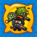 | 浩劫轴心 | 在一场CHIMPS游戏中拥有每个T5狙击手之一 |
|  | 一年的制作 | 打开每日宝箱365次 |
|  | 卡利玛 | 在一个回合中获得10级阿多拉 |
|  | 猴子的12任务 | 完成12个不同的征程 |
|  | 猴（奥）德赛崛起 | 完成50个征程 |
|  | 猴（奥）德赛万古长存 | 完成100个征程 |
|  | 誓言破坏者 | 通过死灵法师复活250,000个气球与你方对抗 |
|  | 恐怖星期五 | 使用100次炼金术士的变身药水能力 |
|  | 准备好了吗？ | 主持并赢取10场组队游戏 |
| 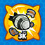 | 古惑狼：泰坦 | 从强化DDT中剥离防御工事3000次 |
|  | 获取代码 | 向挑战浏览器提交挑战 |
|  | 及时行乐 | 在第5层Insta猴使用。注意：即使在使用后，Instas仍会计入您的收藏！ |
|  | Insta世纪 | 使用100只Insta猴。注意：即使在使用后，Instas仍会计入您的收藏！ |
| 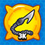 | 咬钩、上线、沉底儿 | 使用 MOAB 追击技能捆绑 3,000 只 MOAB 级气球 |
|  | 移动碉堡 | 使用支援切努克重新部署 1,000 座猴塔 |
|  | 交际花 | 在合作游戏中使用 100 次表情 |
|  | 金光夺目！ | 击破 20 个金色气球 |
|  | 金光闪闪 | 击破 100 个金色气球 |
|  | 金光耀眼 | 击破 500 个金色气球 |
| 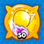 | 魔法黄金 | 在仅限魔法猴子模式下击破 50 个金色气球 |
|  | 团队玩家 | 和猴子团队一起获胜 25 次 |
|  | 团队队长 | 和猴子团队一起获胜 50 次 |
|  | 肝胆相照 | 和猴子团队一起获胜 100 次 |
| 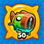 | Like a Boss | Pop 50 Boss Bloons |
| 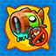 | Davids vs Goliath | Win a boss battle without using a Hero |
|  | So Spiiicey Ninja Kiwi | Beat Spice Islands on Alternate Bloon Rounds with only land towers |
| 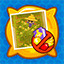 | No Harvest | Beat Cornfield on CHIMPs without removing any corn |
|  | Student Loans | 4 x 10^5 (./achievements_img/Go into $400,000 of debt) |

## 隐藏成就
目前有 12 个已知的隐藏成就，其中包括：

| 图标 | 名称 | 描述 | 解锁方式 |
| - | - | - | - |
|  | 金券 | 布鲁姆帕-卢姆帕-都姆帕-迪-嘟！ | [100%获得小猴塔 （小塔模式）（隐藏成就攻略）额外设置内容[气球塔防6/猴子塔防6]](https://www.bilibili.com/video/av543577676/) |
|  | 大气球 | 帕特更擅长攻击大气球 | 使用并放置英雄`帕特`，并获胜10局 |

## 参考文献
[Steam Bloons TD 6 achievements](./achievements_img/https://steamcommunity.com/stats/960090/achievements)