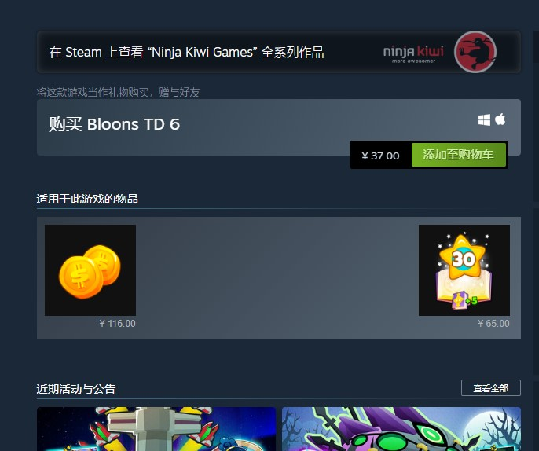

# 额外设置
## 简介
在设置界面，有一个额外选项的图标，点击进去就可以看到你已经解锁的额外设置。

额外设置有5种:

1. 双倍金钱
2. 大气球
3. 小气球
4. 大猴子塔
5. 小猴子塔

## 双倍金钱
双倍金钱是商店中的一个道具，在steam中也可以购买（并且从来没有打过折）。

在购买并在额外设置页面开启后，会有如下效果:

- 初始现金翻倍
- 击破气球获得的现金翻倍
- 回合结束给的现金翻倍
- 对于香蕉农场、商船以及直升机技能等获得的现金**不生效**
- 对于CHIMPS模式和有竞速排名的模式**不生效**

**如何解锁**

商店或steam购买  
{width="300"}
{width="300"}

**如何评价**

`双倍金钱`是一个非常**高效**的设置，有了它，你可以快速地完成除了CHIMPS之外的入门级和中级地图，大大减少了全黑框所需要的时间。在你开始高级地图的初期，也不会那么手忙脚乱了。对于征途模式和非排位的BOSS挑战也可以用，完成每周活动所需要的时间也大大减少。

BTD6最有意思的三大游戏内容，半金模式、CHIMPS模式和竞速活动，也只有半金受影响。（编者喜欢关闭`双倍金钱`去玩半金模式）

所以`双倍金钱`对于玩家来说，起到的是节省时间和辅助入门的作用，当你熟悉这个游戏的整个内容后，是否开启双金模式其实影响不大。

萌新不用担心因为`双倍金钱`减少了游戏乐趣，高手没有`双倍金钱`则能体验到更多乐趣。

## 大气球
游戏中的气球都变大了！

[Todo] 补效果图

**如何解锁**

使用并放置英雄`帕特`，并获胜10局。  
解锁后获得成就`大气球`

## 小气球
游戏中的气球都变小了！

[Todo] 补效果图

**如何解锁**

一局游戏的R100前，炼金005（气球大师炼金术士）击破数达到900,000+  
解锁后获得成就`美人鱼战士和企鹅男孩`

解锁攻略: [气球塔防6 BTD 6 立体主义 点击模式 黑框教程 (内含小气球获取方式)](https://www.bilibili.com/video/av926059210/)

## 大猴子塔
游戏中的猴子塔都变大了！

[Todo] 补效果图

**如何解锁**

- 只使用大猴塔获胜10局游戏
- 能使用的大猴塔包括：船 飞机 直升机 迫击炮 超猴 香蕉 刺钉工厂 猴村 丘吉尔 帕特

解锁攻略: [超详细讲解大猴塔获得方式（大塔模式）（隐藏成就攻略）额外设置内容](https://www.bilibili.com/video/BV1Uh41127iR)

## 小猴子塔
游戏中的猴子塔都变小了！

[Todo] 补效果图

**如何解锁**
在新手地图`糖果瀑布`中完成隐藏任务  
解锁后获得成就`金券`

解锁攻略: [100%获得小猴塔 （小塔模式）（隐藏成就攻略）额外设置内容[气球塔防6/猴子塔防6]](https://www.bilibili.com/video/av543577676/)

## 参考资料
1. [Bloons wiki Double Cash](https://bloons.fandom.com/wiki/Double_Cash)