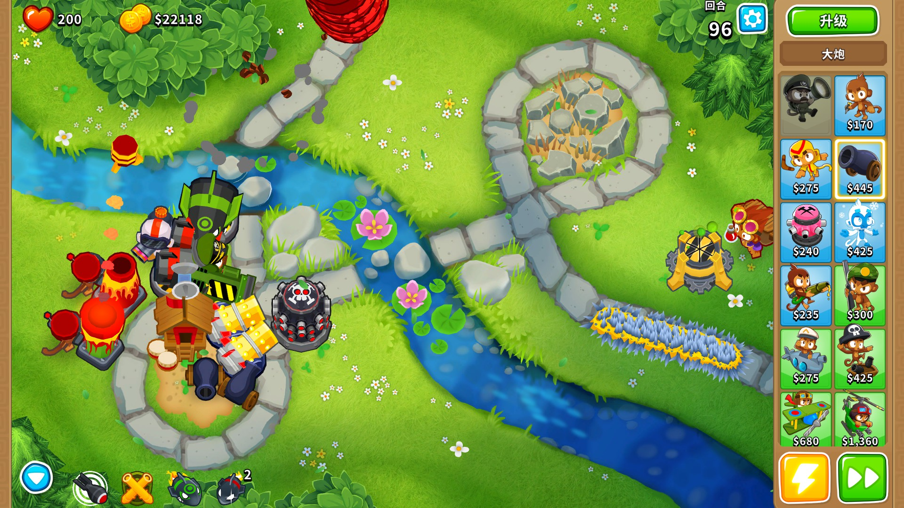

# 欢迎来到 BTD6 Wiki！

## 关于气球塔防6
气球塔防6 （Bloons TD 6 / BTD6) 是由Ninja Kiwi开发和发行的Bloons Tower Defense系列的最新一期和当前旗舰游戏。
该游戏于 2018 年 6 月 13 日在 Android 和 iOS 上发布，随后在 Windows 和 Macintosh 上发布到 Steam。

与其他塔防游戏（包括 BTD 系列中的游戏）一样，Bloons TD 6 的前提是防止被称为“Bloons”的敌方气球走过整个地图，并对玩家造成超过生命值的伤害。玩家需要通过使用建造各式各样的猴子防御塔来击破气球。

{width="300" }

## 关于 Wiki
BTD6 Wiki 致力于成为一个**免费**、**开放**且**持续更新**的 气球塔防6 知识整合站点，大家可以在这里获取与相关的、有趣又实用的知识。我们为大家提供基础知识、游戏机制以及包括点击模式、Boss挑战等高难度挑战相关的内容，帮助大家更快速深入地入门气球塔防6。

BTD6 Wiki 文字内容默认使用《知识共享 署名-非商业性使用-相同方式共享 3.0》协议。

## 急需爱好者们参与到内容贡献中
欢迎所有气球塔防6玩家参与到内容贡献中。内容贡献其实不是困难的事，从编写词条到补充游戏截图，再到完善词条表述，你都可以贡献一份力。

对于所有参与到Wiki的志愿者，Wiki将以“致谢”页面的形式记录其贡献。

本Wiki现有大量图文需要补充，贡献方式和内容见左侧导航栏中的“如何贡献内容”页面。

## 交流方式
非常欢迎大家通过下面的交流方式，加群、交流和分享。
- [QQ群](https://jq.qq.com/?_wv=1027&k=XOUJ90w1): 771620140
- [百度贴吧wiki贴]:
- 发送邮件：BTD6wiki@outlook.com
- [Github](https://github.com/BTD6wiki/BTD6-wiki: https://github.com/BTD6wiki/BTD6-wiki

# 
 
 
 
 