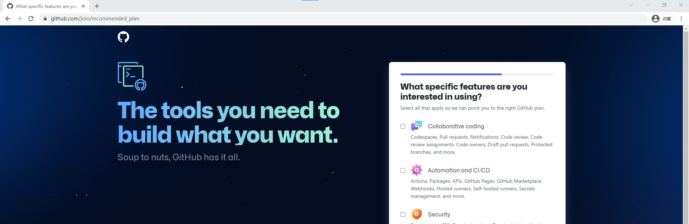
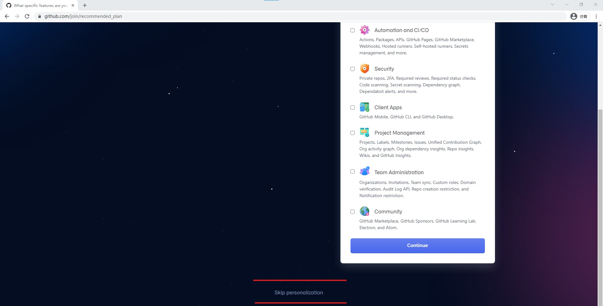

# 如何贡献内容
## 贡献方式
本项目主要使用 [Issues](https://github.com/EndlessLethe/BTD6-wiki/issues) / [QQ群](https://jq.qq.com/?_wv=1027&k=XOUJ90w1) (771620140) / Email(BTD6wiki@outlook.com) 进行交流沟通。

### Github
如果你是计算机相关专业的学生或工作者，推荐使用github来访问并通过pull request的形式将你的贡献合并到库中。

虽然你不是精通计算机，但是你能够**通过某些方式**访问到[Github](https://github.com/)这个不存在的网页，那么推荐通过以下步骤注册账号，并将你的贡献通过issue的形式告知我们。

1. 访问[Github](https://github.com/),并点击右上角的红色框中"Sign in"图标


2. 依次填入邮箱、密码以及你的账户名称


3. 完成机器人测试（可能没有）以及邮件验证码验证
4. 跳过个性化设置页面（将页面拉到最下面），点击"Skip personalize"图标


4. 进入到[Issues](https://github.com/EndlessLethe/BTD6-wiki/issues)页面并

### Email
推荐大家通过邮件将自己贡献的内容发送到邮箱中。

一方面可以及时查看和处理，另一方面便于归档和统计大家的贡献~

邮箱名： BTD6wiki@outlook.com

### QQ群
刚刚创建QQ群，欢迎大家加入~
在这里分享你的困惑，回答他人不解吧~

群名：气球塔防6wiki
群号：771620140
加群链接： https://jq.qq.com/?_wv=1027&k=XOUJ90w1

### 百度贴吧
通过在主题帖下留言。
注：不推荐。贴吧不方便内容管理。

## 急需完善的内容
为了尽快建立起Wiki的整体轮廓，

- 游戏机制下面的所有子页面
	- 各个英雄的介绍 （写法和框架参照“萨乌达”）
	- 力量
	- 知识
- 猴子防御塔的所有子页面
- 进阶模式中各个模式的子页面（主要是过关思路）


## Markdown简介
Markdown 是通过少量符号来控制文章格式的书写方式。使用Markdown的好处是，不用像word一样调整各种各样的格式和大小，只需要专注于文本本身。

主要使用`#`来标记标题，回车来分割段落（两个自然段之间需要插入一个回车来分隔），`!`来插入图片，以及`|`和`-`来表示表格。

下面是标题、换行和表格的用法。

### 标题和换行
可以看出，Markdown和平时文章的书写没有区别，仅仅是多了`#`和自然段之间的回车。

```
# 一级标题

正文

## 二级标题
### 三级标题
```


### 表格
写法：
```
|  表头   | 表头  |
|  ----  | ----  |
| 单元格  | 单元格 |
| 单元格  | 单元格 |
```

效果：
|  表头   | 表头  |
|  ----  | ----  |
| 单元格  | 单元格 |
| 单元格  | 单元格 |


### 插入图片
```
![图片名称][图片在当前文件夹下的相对路径]
![示例][example.jpg]

注：如果图片就在当前文件夹下，直接填入图片名称即可。
```

更多Markdown语法见：[Markdown 教程](https://www.runoob.com/markdown/md-tutorial.html)(https://www.runoob.com/markdown/md-tutorial.html)