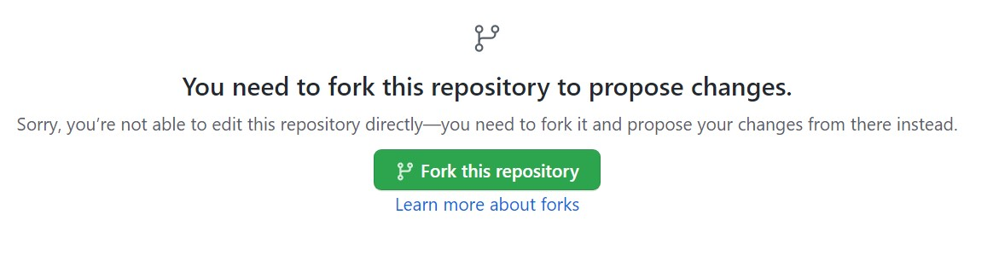
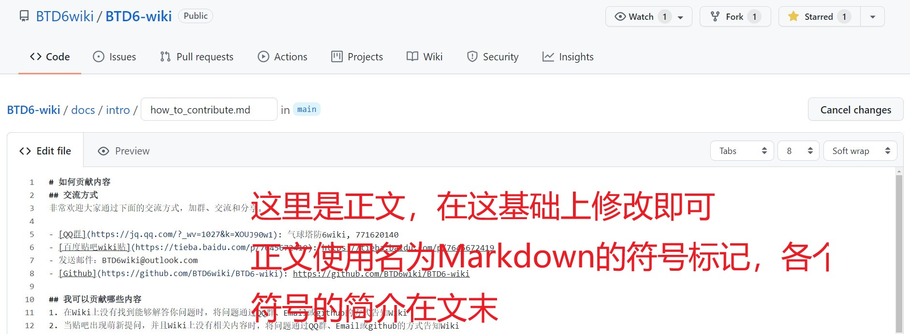
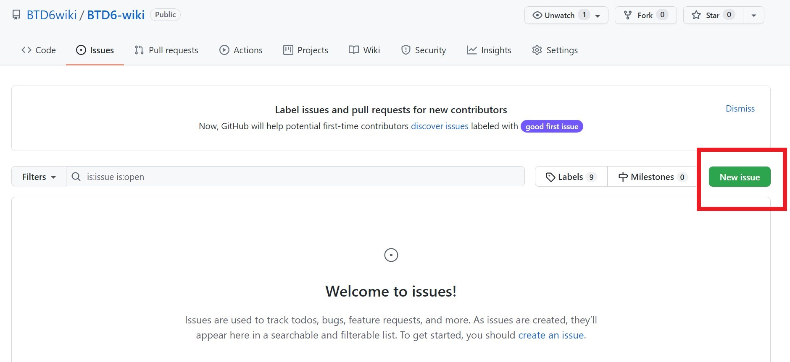

# 如何贡献内容
## 交流方式
非常欢迎大家通过下面的交流方式，加群、交流和分享。

- Wiki页面的"编辑"按钮
- [QQ群](https://jq.qq.com/?_wv=1027&k=XOUJ90w1): 气球塔防6wiki, 771620140
	- 完成轻量级的沟通
	- 群内提供“意见反映”云文档链接，让不太熟悉Github多人协作的贡献者参与到Wiki建设中
- [百度贴吧wiki贴](https://tieba.baidu.com/p/7645672419): https://tieba.baidu.com/p/7645672419
- 发送邮件：BTD6wiki@outlook.com
- [Github](https://github.com/BTD6wiki/BTD6-wiki): https://github.com/BTD6wiki/BTD6-wiki
	- Github的request和issue两大功能都非常容易入门，而且专门为多人协同设计
	- 后文有Github账号的注册步骤说明

## 急需完善的内容
为了尽快建立起Wiki的整体轮廓，

- 游戏机制下面的所有子页面
	- 各个英雄的介绍 （写法和框架参照“萨乌达”）
	- 力量
	- 知识
- 猴子防御塔的所有子页面
- 进阶模式中各个模式的子页面（主要是过关思路）

## 我可以贡献哪些内容
**我只想提出意见**

1. 在Wiki上没有找到能够解答你问题时，将问题通过QQ群、Email或issue的方式告知Wiki
2. 当贴吧出现萌新提问，并且Wiki上没有相关内容时，将问题通过QQ群、Email或issue的方式告知Wiki

**我想参与到Wiki建设中**

3. 对于你可以解答的问题，将解决步骤通过文字（和图片）的方式整理出来，通过Email或github的方式告知Wiki
4. 当你看到很有帮助的、还没有被Wiki涵盖的内容时，将内容整理出来，通过Email或github的方式告知Wiki
5. 你对于Wiki页面的排版、遣词造句或者层次划分不满意，欢迎提出新的想法，并通过QQ群、Email或github的方式告知Wiki


## 如何编辑页面
### 通过Wiki的"编辑"按钮 （发起Request）
1. 在 Wiki 上找到对应页面；
2. 点击正文右上方（目录左侧）的 「编辑此页」（edit）按钮，根据提示跳转到 GitHub 进行编辑；
3. (第一次编辑会出现) 点击下图中绿色按钮即可

3. 在编辑框内编写你想修改的内容；

4. 编写完成后滚动到页面下方，按照下图中 commit 信息格式规范 填写（支持中文），之后点击 Propose changes 按钮提交修改。

5. 点击转跳页面上方会绿色的 Create pull request 按钮
6. 在确认自己的修改后，按照下图中 Pull Request 信息格式规范 填写（支持中文），然后点击页面上的绿色的 Create pull request 按钮。

7. 不出意外的话，你的 Pull Request 就顺利提交到仓库，等待管理员审核并合并到主仓库中即可。
8. 等待合并的时间里，你可以给他人的 Pull Request 提意见、点赞或者点踩。如果有新消息，会在网页右上角出现提示，并附有邮件提醒（取决于个人设置中配置的通知方式）。


### 发起issue
Issue相比与Request，是一个更轻便的功能。它不需要你修改和完善文章，只需像贴吧或论坛一样发帖。

1. 进入到[Issues](https://github.com/BTD6wiki/BTD6-wiki/issues)页面并红框中的"New issue"图标
{width="300" }
2. 如下图所示，填写issue并提交
{width="300" }


## Github注册步骤说明

1. 访问[Github](https://github.com/),并点击右上角的红色框中"Sign in"图标
{width="300" }

2. 依次填入邮箱、密码以及你的账户名称
{width="300" }

3. 完成机器人测试（可能没有）以及邮件验证码验证
4. 跳过个性化设置页面：将页面拉到最下面，点击"Skip personalize"图标
{width="300" }
{width="300" }

**你已经完成了最困难的一步！修改Wiki上你觉得不满意的内容吧！**


## Markdown简介
Markdown 是通过少量符号来控制文章格式的书写方式。使用Markdown的好处是，不用像word一样调整各种各样的格式和大小，只需要专注于文本本身。

主要使用`#`来标记标题，回车来分割段落（两个自然段之间需要插入一个回车来分隔），`!`来插入图片，以及`|`和`-`来表示表格。

下面是标题、换行和表格的用法。

### 标题和换行
可以看出，Markdown和平时文章的书写没有区别，仅仅是多了`#`和自然段之间的回车。

```
# 一级标题

正文

## 二级标题
### 三级标题
```


### 表格
写法：
```
|  表头   | 表头  |
|  ----  | ----  |
| 单元格  | 单元格 |
| 单元格  | 单元格 |
```

效果：

|  表头   | 表头  |
|  ----  | ----  |
| 单元格  | 单元格 |
| 单元格  | 单元格 |


### 插入图片
```
![图片名称][图片在当前文件夹下的相对路径]
![示例][example.jpg]

注：如果图片就在当前文件夹下，直接填入图片名称即可。
```

更多Markdown语法见：[Markdown 教程](https://www.runoob.com/markdown/md-tutorial.html)(https://www.runoob.com/markdown/md-tutorial.html)