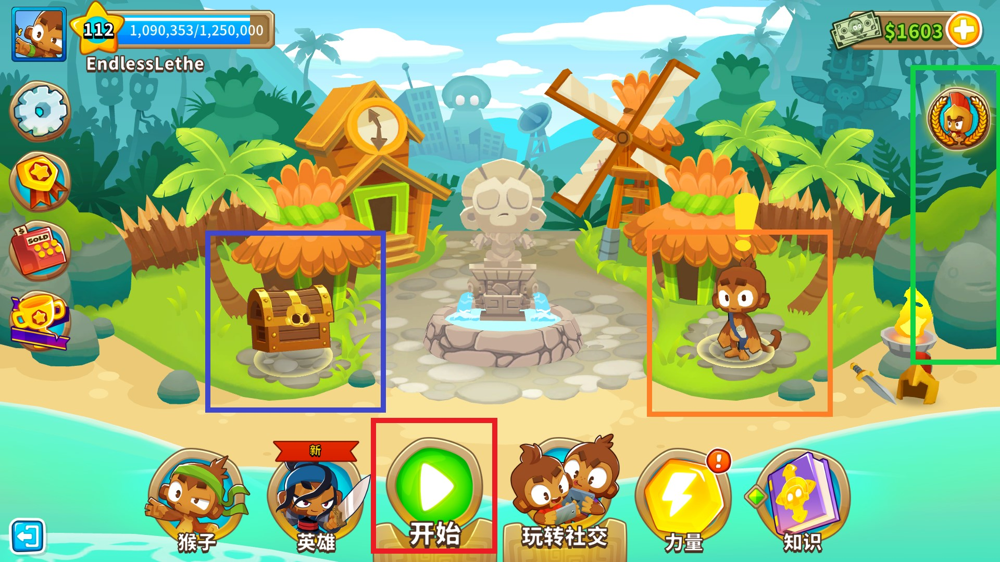
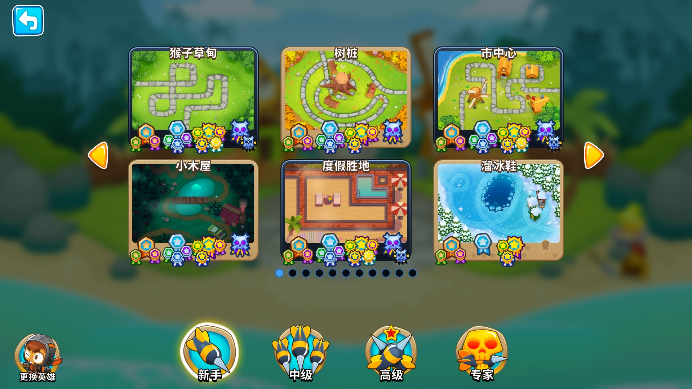

# 如何开始这个游戏
气球塔防6支持跨平台游玩，包括Windows、Mac两大桌面系统，以及安卓、iPad和iPhone等移动设备系统。

选择一个你喜欢的设备，然后畅快开玩吧！我们这里提供简单的安装以及入门教程。

## 安装
### PC / Steam
对于Windows或Mac用户，我们都可以通过Steam来获取游戏！

### 安卓
Google Play

### iPad / iPhone
Apple Store 需要新建（如果没有的话）一个美国Apple账户，在 Apple Store 即可搜索并下载。

## 入门教程
### 主界面
左上角显示玩家等级和经验条，右上角显示猴钞数量。

比较常用到的入口有四个：
1. 蓝色框中的宝箱，点击可以完成每日签到
2. 红色框中的开始图标，点击可以进入常规模式下的选关界面
3. 橙色框中的猴子，点击可以查看每天的各种挑战任务
4. 绿色框中通常会有0到3个限时图标，每个图标每周只开放3、4天。这里每个图标对应游戏的进阶游戏模式（征程模式、竞速模式和BOSS挑战）。

### 进入一局游戏
对于刚刚接触BTD6的玩家来说，我们点击红色框中的开始图标，直接开始冒险吧！

进入选图界面之后，点击左上角的第一个地图“猴子草甸”，放置你的英雄并开始游戏吧！

## 参考资料
[直播]开新档玩BTD6 https://tieba.baidu.com/p/6468461730
